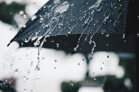

#### 博客由来

我家住上海周边的昆山花桥，工作在上海长宁，每天早晨做8点的大巴花2个小时过去，晚上同样2个小时回来，一来一回总共有4个小时的时间。

车上怎么样打发时间呢？

困了就睡一觉，无聊就听听Podcast，有精力就顺便写点东西。
<!--more-->

#### 特别感谢
感谢老婆-朵朵对我的一路支持，愿生活充满阳光，一路鸟语花香。

#### 书籍推荐
书名：《Shaping Things》 作者：Bruce Sterling
推荐理由：What is spime?什么是科技时代的物联网，或许你可以从这里获得启发。

---
